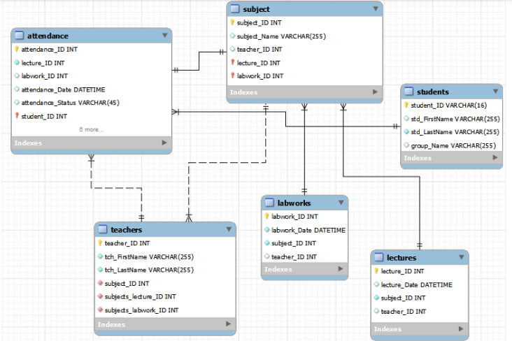

# Havor_21_SpringCourse

## Overview
This repository keeps information for monitoring and recording attendance in lectures and labs at educational institutions, providing real-time management for administrators, instructors, and students.

## Functional requirements
**Authorization, registration and authentication:**
- Users get registration with provide their information such as name, email address, and a chosen password.
- Login to the system using a user ID and password.
- Definition of access levels (administrator, teacher, student).

**User management:**
- The system administrator must be able to add, edit and delete users.
- Users should be able to change their personal data (e.g. password).

**Course management**
- The administrator should be able to add new courses to the system.
- Instructors should be able to view and edit course information.

**Attendance log**
- The teacher should be able to create attendance logs for lectures and laboratory work.
- The system should store information about students attendance at lectures and laboratory work.

**Message:**
- The ability to send messages to students and teachers about important events (for example, changing the schedule of lectures or laboratories).

**Reports**
- The instructor should be able to generate student attendance reports for each course.
- Reports must include information on the number of missed and attended classes for each student.

**Mobile access:**
- Providing a mobile version of the application for convenient attendance tracking.

**Integration:**
- Integration with other university systems to obtain additional data about students and teachers (for example, timetable information).

**Settings**
- The system must be configurable to establish personalized settings for each course and instructor.

## REST API endpoints
**Authentication:**
- POST /api/auth/login: Login to the system using user ID and password.
- POST /api/auth/logout: Logout from the system.

**User Management:**
- GET /api/users: Get all users (admin only).
- GET /api/users/{id}: Get user details.
- POST /api/users: Create a new user (admin only).
- PUT /api/users/{id}: Update user details.
- DELETE /api/users/{id}: Delete a user (admin only).
- PUT /api/users/{id}/password: Change user password.

**Course Management:**
- GET /api/courses: Get all courses.
- GET /api/courses/{id}: Get course details.
- POST /api/courses: Create a new course (admin only).
- PUT /api/courses/{id}: Update course details (admin or instructor).
- DELETE /api/courses/{id}: Delete a course (admin only).

**Attendance Log:**
- POST /api/attendance/{courseId}/lectures: Create attendance log for lectures (teacher only).
- POST /api/attendance/{courseId}/labs: Create attendance log for labs (teacher only).
- GET /api/attendance/{courseId}/students: Get attendance information for students in a course.

**Messaging**
- POST /api/messages/students: Send a message to students (admin or teacher).
- POST /api/messages/teachers: Send a message to teachers (admin or teacher).

**Reports**
- GET /api/reports/{courseId}/attendance: Generate student attendance report for a course (teacher only).

**Mobile Access**
- Behavior: Provide a mobile version of the application for attendance tracking.
  
**Integration**
- Behavior: Integrate with university systems for additional student and teacher data.

**Settings**
- Behavior: Configure personalized settings for each course and instructor.

## Database 

